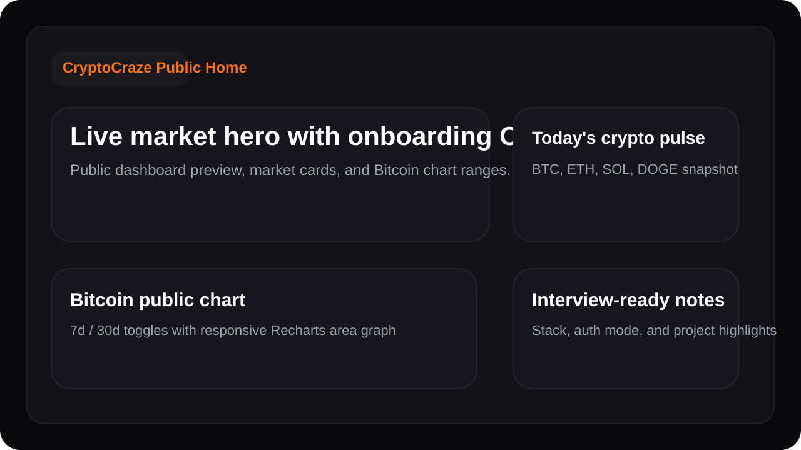
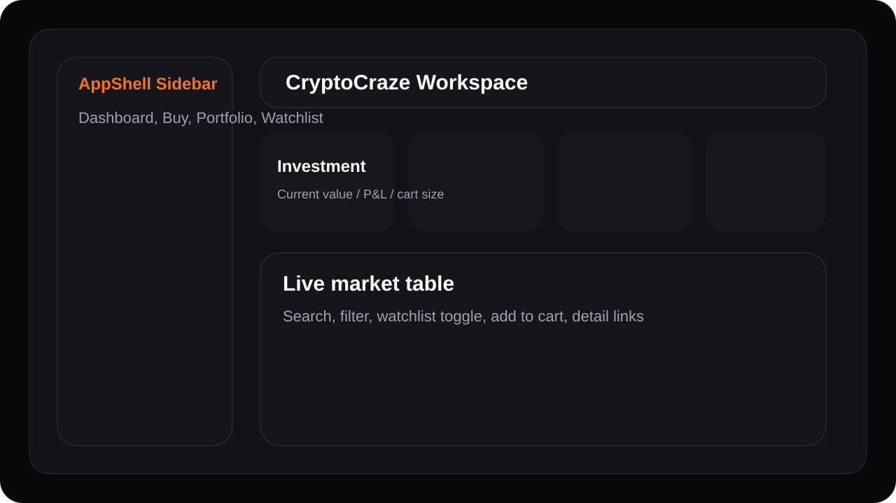
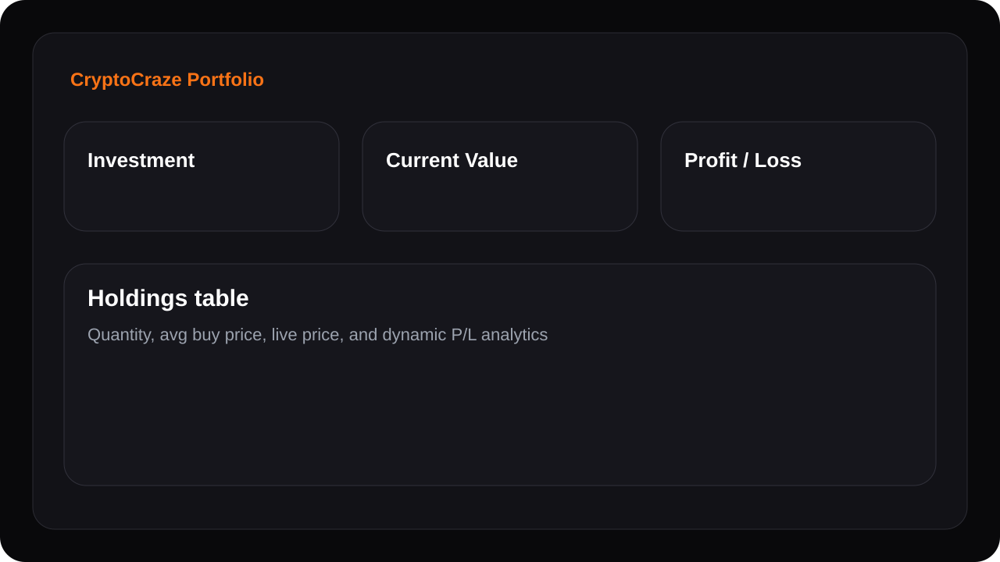

# CryptoCraze

CryptoCraze is a production-style cryptocurrency platform built with React, Vite, Tailwind CSS, Firebase authentication, Firestore persistence, CoinGecko market data, Razorpay payments, and Recharts visualizations. It is designed to be strong enough for software engineering resumes, technical interviews, and campus placement showcases.

## Live Demo
   (https://cryptocraze-web.onrender.com/)

## Features

- Secure signup and login flow with Firebase Auth support.
- Local demo auth fallback so the project still runs without backend secrets.
- Real-time cryptocurrency dashboard using the CoinGecko API.
- Search and filter for live market data.
- Coin detail pages with interactive 7-day and 30-day charts.
- Watchlist management.
- Cart flow with quantity updates and simulated purchase checkout.
- Portfolio tracking with average buy price, investment totals, live value, and profit/loss.
- Toast notifications, loading states, and mobile-responsive layout.
- Deployment-ready configuration for Vercel and Firebase.

## Tech Stack

- Frontend: React 19 + Vite
- Styling: Tailwind CSS v4
- Routing: React Router
- Backend: Firebase Auth + Firestore support
- API server: Express + Firebase Admin SDK
- Market API: CoinGecko API
- Charts: Recharts
- Notifications: react-hot-toast
- Motion: Framer Motion
- Icons: lucide-react

## Screenshots

Public home preview:



Authenticated dashboard preview:



Portfolio analytics preview:



## Project Structure

```text
src/
  app/                Router and provider wiring
  components/         Reusable UI, layout, chart, and market table components
  contexts/           Auth and user data state containers
  hooks/              Shared hooks such as auth access and debounced values
  lib/                Firebase initialization
  pages/              Route-level screens
  services/           Auth, persistence, and CoinGecko API clients
  utils/              Formatters and helper utilities
public/
  crypto-logo.png
docs/screenshots/
  *.svg preview assets for README
```

## Setup

### 1. Install dependencies

```bash
npm install
```

### 2. Configure environment variables

Copy `.env.example` to `.env` and fill in your Firebase project values:

```bash
cp .env.example .env
```

Required variables:

- `VITE_FIREBASE_API_KEY`
- `VITE_FIREBASE_AUTH_DOMAIN`
- `VITE_FIREBASE_PROJECT_ID`
- `VITE_FIREBASE_STORAGE_BUCKET`
- `VITE_FIREBASE_MESSAGING_SENDER_ID`
- `VITE_FIREBASE_APP_ID`
- `VITE_COINGECKO_API_BASE`
- `FIREBASE_PROJECT_ID`
- `FIREBASE_CLIENT_EMAIL`
- `FIREBASE_PRIVATE_KEY`

If Firebase variables are left empty, CryptoCraze automatically runs in demo mode using localStorage for auth and app data.

### 3. Run locally

```bash
npm run dev
```

### 4. Create a production build

```bash
npm run build
```

### 5. Preview production build locally

```bash
npm run preview
```

## Firebase Setup

1. Create a Firebase project.
2. Enable Email/Password authentication in Firebase Auth.
3. Create a Firestore database in production or test mode.
4. Apply the included [`firestore.rules`](./firestore.rules) file.
5. Add your browser Firebase config values to the `VITE_FIREBASE_*` variables in `.env`.
6. Create a Firebase service account key and add its `project_id`, `client_email`, and `private_key` values to `FIREBASE_PROJECT_ID`, `FIREBASE_CLIENT_EMAIL`, and `FIREBASE_PRIVATE_KEY`. Keep private-key newlines escaped as `\n` in `.env`.

## Deployment

### Frontend on Vercel

1. Push the repository to GitHub.
2. Import the project into Vercel.
3. Set the build command to `npm run build`.
4. Set the output directory to `dist`.
5. Add the same `VITE_*` environment variables in the Vercel dashboard.
6. The included [`vercel.json`](./vercel.json) handles SPA routing rewrites.

### Backend services on Firebase

- Firebase Auth provides secure user authentication.
- Firestore stores user watchlists, carts, and portfolio state when Firebase is configured.
- In demo mode, localStorage is used so the app still runs without cloud setup.

## Notes

- The active application entry is the React/Vite app under `src/`.
- Legacy static prototype files from earlier iterations remain in the workspace but are not used by the Vite build.
